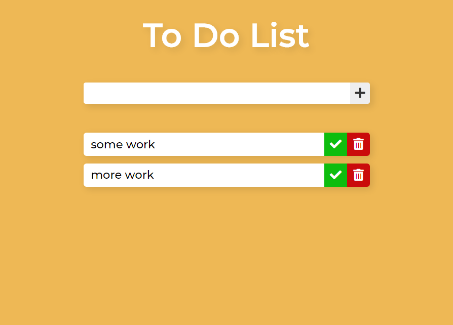

# Vanilla-Javascript-todo-list
I created a simple Todo List using Vanilla JavaScript to learn some concept such as creating elements, adding and removing them from DOM and also storing the data in local storage. 
\
\
check the todo list here -> https://codepen.io/paramkeshkamat/full/PozxpKJ
\
\

